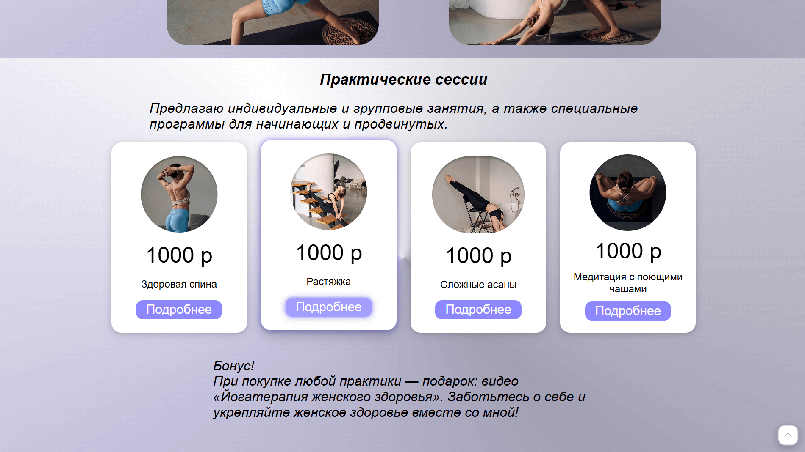
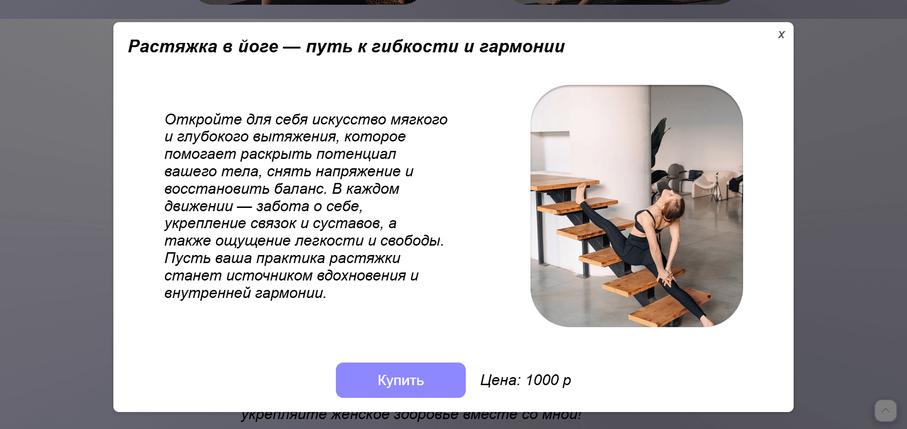
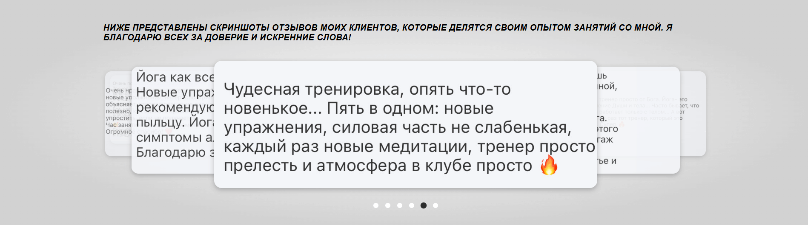

# hatha-yoga-master-site

  
  
  

###

## Описание:

Сайт разработан для презентации себя и продажи своих практик, где пользователи могут:

- Ознакомиться с предложенными практиками
- Совершить оплату
- Оставить заявку через Яндекс Формы (данные не сохраняются на сайте)

## О проекте:

Сайт реализован на препроцессоре Sass. В проекте были использованы следующие технологии:

- Frontend:

  
  
  

- Формы: Яндекс Формы (без backend-обработки)

- Деплой: GitHub Pages, Bget

В проекте есть анимация наведения курсора на кнопки

Также в нем есть рабочая навигация по разделам страницы

Для удобства пользователей реализована кнопка "вверх"

## Функционал и интерактивность:

- [x] Адаптивность: корректное отображение на всех устройствах
- [x] Динамические кнопки – интерактивные hover-эффекты
- [x] Модальные окна – информация о практиках с описанием и ценой, так же ознакомление с дипломами
- [x] Оплата – интеграция платежного шлюза
- [x] Форма заявки – отправка данных в Яндекс Формы без хранения на сервере
- [x] Кнопка «back» закрывает страницу и возвращает пользователя на предыдущий экран
- [x] Слайдер - для просмотра отзывов

###

## Команда проекта:

## Результат:

[Перейти по ссылке 👈 ](https://egoirinavl.ru/)
